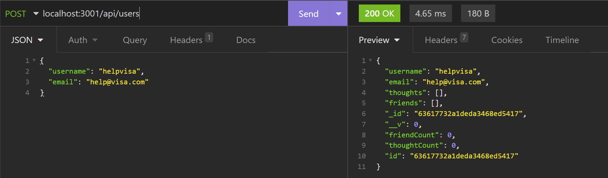

# NoSQL Social Media Backend

## Table of Contents
- [Description](#description)
- [Installation](#installation)
- [Images](#images)

## Description

An example backend created to encompass some of the basic features needed to create a twitter-like social media website (friends, posts, users). The API uses Mongoose and MongoDB to manage its data.

## Installation

Firstly ensure that MongoDB is installed and its server is running; next, traverse to the repository's root directory and run "npm install" to acquire the necessary dependencies. At this point, the application should be ready to go; it can be run using "npm start", and its endpoints' functionality can be checked in a program such as Insomnia.

## Images

